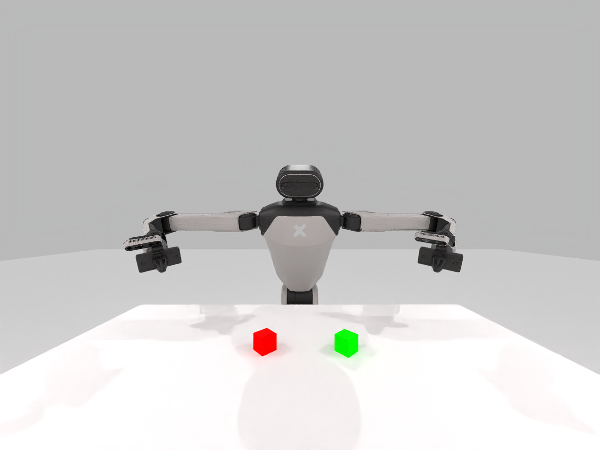
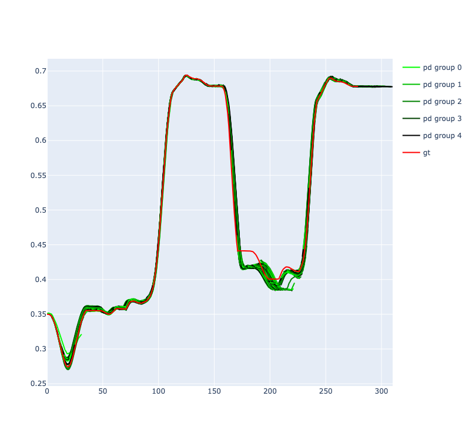
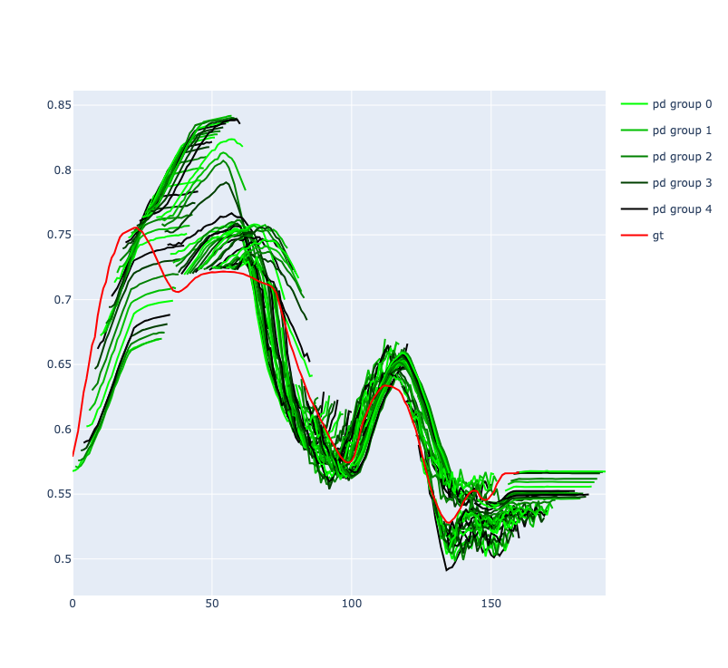
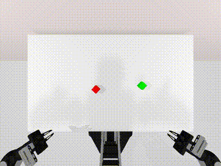
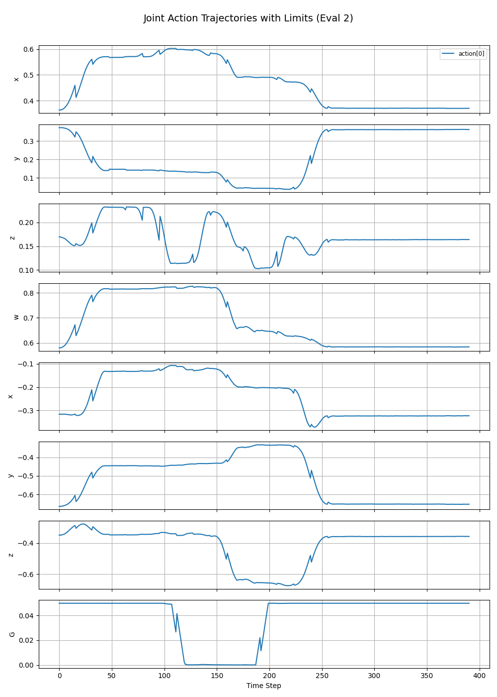

<!-- TITLE & BADGES -->
# 🤖 Galaxea DP

<p align="center">
  <!-- 👉 Replace with your own banner or project GIF -->
  
</p>

<p align="center">
  <!-- Python version -->
  
  <!-- CUDA -->
  
  <!-- License -->
  <a href="LICENSE">
    
  </a>
</p>

**GalaxeaDP** is the **open implementation of the diffusion policy algorithm**, fully compatible with [GalaxeaManipSim](https://github.com/OpenGalaxea/GalaxeaManipSim) and [GalaxeaLeRobot](https://github.com/OpenGalaxea/GalaxeaLeRobot).
It enables **end-to-end simulation pipelines** — from **data generation** to **training**, **evaluation**, and **deployment in simulation** — for the **Galaxea R1 series** (R1, R1 Pro, R1 Lite).  
> ℹ️ Real-world datasets and end-effector controller for R1 Lite will be released later — stay tuned!

# ✨ Features

- 🛠 **Full Simulation Pipeline** – From data collection in GalaxeaManipSim to training and simulation evaluation.
- 📦 **One-Click Scripts** – Automate data generation, training, and evaluation.
- 📂 **LeRobot Dataset Format** – Standardized data format for easy integration.
- 🔄 **Open-Loop Evaluation** – Visualize predictions vs ground truth.
- 🎯 **Multiple Control Modes** – Support for both end-effector and joint control in simulation.

# 🚀 Installation
This installs **GalaxeaDP** together with **GalaxeaManipSim** and **GalaxeaLeRobot** dependencies.
```
conda create -n opengalaxea python=3.10

git clone https://github.com/OpenGalaxea/GalaxeaDP.git
cd GalaxeaDP
pip install -r requirements.txt

cd ..
git clone https://github.com/OpenGalaxea/GalaxeaManipSim.git
cd GalaxeaManipSim
pip install --no-deps -e .

cd ..
git clone https://github.com/OpenGalaxea/GalaxeaLeRobot.git
cd GalaxeaLeRobot
pip install --no-deps -e .
```

## ⚡ Quick Start: One-Click Workflow with Provided Bash Scripts
We provide bash scripts to automate the following workflows:

* Generate data in simulation, train GalaxeaDP, perform open-loop evaluation, and validate in simulation:

  ```bash
  bash scripts/sim_r1pro_blocks.sh
  ```

* *(Real-world data support coming soon)* Train GalaxeaDP using real-world datasets once released, perform open-loop evaluation, and validate in simulation.


# 🛠 Data Generation & Conversion
There are two ways to generate data: using the accompanying `GalaxeaManipSim` simulation environment for automatic generation, or collecting it manually through teleoperation in the real world.

## 📦 Pre-generated Data & Models (Optional)
We provide data for the simulation task **Stack Cube**, along with the models trained on it. You can download them directly for training or evaluation.

Download the data (simulation task Stack Cube) to skip the **Generate and convert data** step.
```
gdown --folder https://drive.google.com/drive/folders/1qBY5OuTXrP3r1H8X9duUekyTEfgDFwvb
# After downloading, you will see
# R1ProBlocksStackEasy_eef.zip
# R1ProBlocksStackEasy_joints.zip
# R1LiteBlocksStackEasy_joints.zip
# After unzipping, please put your data under /root/.cache/huggingface/lerobot/galaxea/
```
Download the Models (trained on Stack Cube) to skip the **Training** section.
```
gdown --folder https://drive.google.com/drive/folders/1zWgMPXyWryNDz7pHTJzlwPjoszMGd3q1
# After downloading, you will see
# R1Pro_eef.ckpt
# R1Pro_joints.ckpt
# R1Lite_joints.ckpt
```

## 🖥 Data Generation & Conversion in Simulation
The provided command will sequentially perform the following operations: 
- Generate task data (in H5 format) using a script in `GalaxeaManipSim`.
- Replay the trajectories in the environment using the IK controller to filter out those with no IK solution while collecting image observations.
- Convert the H5 data into the `lerobot` format using a script.
For details on each part, please refer to `GalaxeaManipSim/README.md`.
```
python -m galaxea_sim.scripts.collect_demos --env-name $env --num-demos 100 --datasets_dir data
python -m galaxea_sim.scripts.replay_demos --env-name $env --target_controller_type bimanual_relaxed_ik --num-demos 100 --dataset_dir data
python -m galaxea_sim.scripts.convert_single_galaxea_sim_to_galaxea_lerobot --task $env --tag replayed --robot r1_pro --use_eef --dataset_dir $dataset_dir
```

## 🌍 Real-world (coming soon)
Support for real-world datasets will be released in the future, including tools to convert MCAP recordings into the `lerobot` format for training and evaluation.


# 🛠 Training
First, specify the dataset path to load in the corresponding `task.json` file. Then, specify the GPU to use to start training (the device index here is based on `CUDA_VISIBLE_DEVICES`). `GALAXEA_DP_WORK_DIR` defines the path where results (model checkpoints and subsequent evaluation outputs) will be saved.
```
export GALAXEA_DP_WORK_DIR=out
bash train.sh trainer.devices=[0,1,2,3] task=sim/R1ProBlocksStackEasy_eef
```
If you don’t have a stable internet connection to Weights & Biases (`wandb`), setting `WANDB_MODE=offline` can be helpful. If you encounter performance issues (typically seen as a \~20s stall before the progress bar starts updating in each epoch), this may be caused by inefficient data access in `LeRobotDataset`. Setting `use_cache: True` and `num_workers: 1` in the dataset configuration will resolve this at the cost of increased memory usage.

# 📊 Evaluation
## 📈 Open-loop action chunk prediction
Run the following command to perform open-loop evaluation: this will load the val split of the dataset, extract observations, run inference using the model, and then plot and save the ground-truth (gt_action) and predicted action chunk for each dimension in every episode. The outputs will be saved in HTML format, one folder per episode, named by timestamp, under the same directory.
```
bash eval_lerobot.sh trainer.devices=[0] task=open_galaxea/<robot>/<task> ckpt_path=out/open_galaxea/<robot>/<task>/<time>/checkpoints/step_20000.ckpt
```
The following three lines are optional—they move the evaluation output (latest path) into the model directory (second most recent path) and rename it to eval_openloop for easier management.
```
train_output=$(ls -1 out/open_galaxea/<robot>/<task>/$env | sort | tail -n 2 | head -n 1)
eval_output=$(ls -1 out/open_galaxea/<robot>/<task>/$env | sort | tail -n 1)
mv out/open_galaxea/<robot>/<task>/$eval_output out/open_galaxea/<robot>/<task>/$train_output/eval_open_loop
```
You can quickly preview them using the [Live Preview](https://marketplace.visualstudio.com/items?itemName=ms-vscode.live-server) extension in VS Code.
<p align="center">
  
  
</p>

<p align="center">
  <em>prediction of R1ProBlocksStackEasy and real world block pick</em>
</p>

## 🖥 Simulation evaluation
Run the policy in `GalaxeaManipSim`, save the rollout videos, visualize the output actions (for the left arm), and print the success rate.
```
bash eval_sim.sh trainer.devices=[0] task=sim/<task> ckpt_path=out/sim/<task>/checkpoints/step_20000.ckpt
```
<p align="center">
  
  
</p>

<p align="center">
  <em>saved video and action curve</em>
</p>

# 🧑‍💻 Development

## 📂 Dataset
We use the standard `lerobot` format for datasets, with feature names and shapes defined as follows (taking R1Pro as an example; see `tools/data_converter/dataset_converter.py` for details).
```python
"observation.images.head_rgb": (360, 640, 3),
"observation.images.left_wrist_rgb": (480, 640, 3),
"observation.images.right_wrist_rgb": (480, 640, 3),

"observation.state.left_arm": (7,), # from base to end
"observation.state.left_arm.velocities": (7,),
"observation.state.right_arm": (7,),
"observation.state.right_arm.velocities": (7,),

"observation.state.left_ee_pose": (7,), # x,y,z,qx,qy,qz,qw
"observation.state.right_ee_pose": (7,), # x,y,z,qx,qy,qz,qw

"observation.state.left_gripper": (1,),
"observation.state.right_gripper": (1,),

"observation.state.chassis": (3,),
"observation.state.chassis.velocities": (6,), # vx,vy,vz,ax,ay,az

"observation.state.torso": (4,),
"observation.state.torso.velocities": (4,),

"action.left_ee_pose": (7,),
"action.right_ee_pose": (7,)

"action.left_arm": (7,),
"action.right_arm": (7,),

"action.left_gripper": (1,),
"action.right_gripper": (1,),
```

## 🧠 Policy

### 📑 Data Sample Example
```
sample = dict(
    obs = dict(
        left_ee_pose: torch.Tensor(obs_size, 7), # used for EE control
        right_ee_pose: torch.Tensor(obs_size, 7),
        left_arm: torch.Tensor(obs_size, arm_size), # used for joint control, arm_size=7 for R1Pro, 6 for R1 and R1Lite
        right_arm: torch.Tensor(obs_size, arm_size),
        left_gripper: torch.Tensor(obs_size, 1),
        right_gripper: torch.Tensor(obs_size, 1),
        episode_start_left_ee_pose: torch.Tensor(1, 7), # used for relative EE control
        episode_start_right_ee_pose: torch.Tensor(1, 7),
        head_rgb: torch.Tensor(obs_size, 3, H, W),
        left_wrist_rgb: torch.Tensor(obs_size, 3, H, W),
        left_wrist_rgb: torch.Tensor(obs_size, 3, H, W),
    ),
    action = dict(
        left_ee_pose: torch.Tensor(chunk_size, 7), # used for EE control
        right_ee_pose: torch.Tensor(chunk_size, 7),
        left_arm: torch.Tensor(chunk_size, arm_size), # used for joint control
        right_arm: torch.Tensor(chunk_size, arm_size),
        left_gripper: torch.Tensor(chunk_size, 1),
        right_gripper: torch.Tensor(chunk_size, 1),
    ),
    gt_action = action, # for open-loop validation
)
```

## 🏷️ License
This repository is released under the MIT license. See [LICENSE](LICENSE) for additional details.


## 🙏 Acknowledgements
Our code is generally built on top of amazing open-source projects:
[Diffusion Policy](https://github.com/real-stanford/diffusion_policy), [LeRobot](https://github.com/huggingface/lerobot), [Robotwin](https://github.com/robotwin-Platform/RoboTwin).


## 📚 Citation

If you find our work useful, please consider citing:
```
@inproceedings{GalaxeaDP,
	title={Galaxea Diffusion Policy},
	author={Galaxea Team},
	year={2025}
}